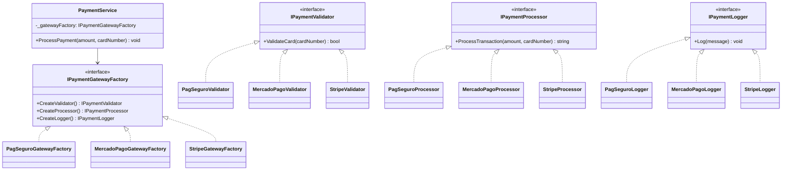

## 🥁 CarnaCode 2026 - Desafio 01 - Abstract Factory

Oi, eu sou o Ronaldo e este é o espaço onde compartilho minha jornada de aprendizado durante o desafio **CarnaCode 2026**, realizado pelo [balta.io](https://balta.io). 👻

Aqui você vai encontrar projetos, exercícios e códigos que estou desenvolvendo durante o desafio. O objetivo é colocar a mão na massa, testar ideias e registrar minha evolução no mundo da tecnologia.

### Sobre este desafio
No desafio **Abstract Factory** eu tive que resolver um problema real implementando o **Design Pattern** em questão.
Neste processo eu aprendi:
* ✅ Boas Práticas de Software
* ✅ Código Limpo
* ✅ SOLID
* ✅ Design Patterns (Padrões de Projeto)

## Problema
Uma plataforma de e-commerce precisa integrar com múltiplos gateways de pagamento (PagSeguro, MercadoPago, Stripe) e cada gateway tem componentes específicos (Processador, Validador, Logger).
O código atual está muito acoplado e dificulta a adição de novos gateways.

## Solução — Abstract Factory

### O problema no código original

No código original (`Challenge.cs`), a classe `PaymentService` utiliza um **`switch` case** para decidir quais componentes instanciar com base no nome do gateway recebido como `string`. Isso gera os seguintes problemas:

- **Alto acoplamento**: `PaymentService` conhece e depende diretamente de todas as classes concretas de todos os gateways.
- **Violação do Open/Closed (SOLID)**: para adicionar um novo gateway, é necessário **modificar** o `PaymentService`, adicionando mais um `case` ao switch.
- **Risco de mistura acidental**: como a criação dos componentes é manual (`new PagSeguroValidator()`, `new StripeProcessor()`...), nada impede que o desenvolvedor combine componentes de gateways diferentes por engano.

### Como o Abstract Factory resolve

O padrão **Abstract Factory** introduz uma interface (`IPaymentGatewayFactory`) que encapsula a criação de todos os componentes de um gateway. Cada gateway implementa essa interface em sua própria **factory concreta**, que garante que todos os componentes criados pertencem à mesma família.

O `PaymentService` passa a receber a factory por **injeção de dependência** no construtor e trabalha exclusivamente com as interfaces — sem saber qual gateway concreto está sendo utilizado.

### Interfaces criadas

| Interface | Responsabilidade no padrão |
|---|---|
| `IPaymentValidator` | **Produto abstrato** — define o contrato para validação de cartão (`ValidateCard`) |
| `IPaymentProcessor` | **Produto abstrato** — define o contrato para processamento de transação (`ProcessTransaction`) |
| `IPaymentLogger` | **Produto abstrato** — define o contrato para registro de log (`Log`) |
| `IPaymentGatewayFactory` | **Abstract Factory** — declara os métodos de criação: `CreateValidator()`, `CreateProcessor()` e `CreateLogger()` |

### Implementações concretas

| Classe | Responsabilidade no padrão |
|---|---|
| `PagSeguroValidator` | **Produto concreto** — valida cartões segundo as regras do PagSeguro |
| `PagSeguroProcessor` | **Produto concreto** — processa transações no formato PagSeguro (`PAGSEG-xxx`) |
| `PagSeguroLogger` | **Produto concreto** — registra logs com prefixo `[PagSeguro Log]` |
| `PagSeguroGatewayFactory` | **Factory concreta** — cria os 3 componentes do PagSeguro, garantindo compatibilidade |
| `MercadoPagoValidator` | **Produto concreto** — valida cartões segundo as regras do MercadoPago (inicia com `5`) |
| `MercadoPagoProcessor` | **Produto concreto** — processa transações no formato MercadoPago (`MP-xxx`) |
| `MercadoPagoLogger` | **Produto concreto** — registra logs com prefixo `[MercadoPago Log]` |
| `MercadoPagoGatewayFactory` | **Factory concreta** — cria os 3 componentes do MercadoPago |
| `StripeValidator` | **Produto concreto** — valida cartões segundo as regras do Stripe (inicia com `4`) |
| `StripeProcessor` | **Produto concreto** — processa transações no formato Stripe (`STRIPE-xxx`) |
| `StripeLogger` | **Produto concreto** — registra logs com prefixo `[Stripe Log]` |
| `StripeGatewayFactory` | **Factory concreta** — cria os 3 componentes do Stripe |

### Classe cliente

| Classe | Responsabilidade no padrão |
|---|---|
| `PaymentService` | **Cliente** — recebe `IPaymentGatewayFactory` via construtor e usa os métodos da factory para criar e utilizar Validator, Processor e Logger. Não conhece nenhuma classe concreta. |

### Resultado

Para adicionar um **novo gateway** (ex: PayPal), basta criar 4 arquivos novos (`PayPalValidator`, `PayPalProcessor`, `PayPalLogger`, `PayPalGatewayFactory`) — **sem modificar nenhuma linha** do `PaymentService` ou de qualquer outro gateway existente.



## Estrutura do Projeto

```
src/
├── Challenge.cs                  # Código original (referência)
│
├── IPaymentValidator.cs          # Interface - Validação
├── IPaymentProcessor.cs          # Interface - Processamento
├── IPaymentLogger.cs             # Interface - Log
├── IPaymentGatewayFactory.cs     # Interface - Abstract Factory
│
├── PagSeguroValidator.cs         # PagSeguro - Validação
├── PagSeguroProcessor.cs         # PagSeguro - Processamento
├── PagSeguroLogger.cs            # PagSeguro - Log
├── PagSeguroGatewayFactory.cs    # PagSeguro - Factory
│
├── MercadoPagoValidator.cs       # MercadoPago - Validação
├── MercadoPagoProcessor.cs       # MercadoPago - Processamento
├── MercadoPagoLogger.cs          # MercadoPago - Log
├── MercadoPagoGatewayFactory.cs  # MercadoPago - Factory
│
├── StripeValidator.cs            # Stripe - Validação
├── StripeProcessor.cs            # Stripe - Processamento
├── StripeLogger.cs               # Stripe - Log
├── StripeGatewayFactory.cs       # Stripe - Factory
│
├── PaymentService.cs             # Serviço refatorado (sem switch)
├── Program.cs                    # Ponto de entrada
└── AbstractFactory.csproj        # Projeto .NET
```

## Sobre o CarnaCode 2026
O desafio **CarnaCode 2026** consiste em implementar todos os 23 padrões de projeto (Design Patterns) em cenários reais. Durante os 23 desafios desta jornada, os participantes são submetidos ao aprendizado e prática na idetinficação de códigos não escaláveis e na solução de problemas utilizando padrões de mercado.

### eBook - Fundamentos dos Design Patterns
Minha principal fonte de conhecimento durante o desafio foi o eBook gratuito [Fundamentos dos Design Patterns](https://lp.balta.io/ebook-fundamentos-design-patterns).

### Veja meu progresso no desafio
[Repositório Central CarnaCode2026](https://github.com/ronaldofas/balta-desafio-carnacode-2026-central)
